<html><head><meta content="text/html; charset=UTF-8" http-equiv="content-type"></head><body class="c22 doc-content"><h1 class="c17" id="h.4eb9bk6ogrdf">Ch&#432;&#417;ng 1: Gi&#7899;i thi&#7879;u</h1><ol class="c9 lst-kix_shqr35mgbm3b-0 start" start="1"><li class="c7 c6 li-bullet-0"><h2 id="h.22i6glv9j55g" style="display:inline">Zeek</h2></li></ol>
Kh&aacute;m ph&aacute; v&agrave; ph&acirc;n t&iacute;ch c&#7911;a b&#7841;n<a class="c14" href="https://www.google.com/url?q=https://zeek.org/&amp;sa=D&amp;source=editors&amp;ust=1718437905156080&amp;usg=AOvVaw20Q7jE28edDF0UPYHQrE1_">&nbsp;</a><a class="c14" href="https://www.google.com/url?q=https://zeek.org/&amp;sa=D&amp;source=editors&amp;ust=1718437905156447&amp;usg=AOvVaw0_fge9STZwQxcQWGWPQbP2">trang web ch&iacute;nh th&#7913;c</a>, ch&uacute;ng ta c&oacute; th&#7875; tr&iacute;ch xu&#7845;t nh&#432; sau &#272;i&#7875;m quan tr&#7885;ng&nbsp;v&#7873; c&ocirc;ng c&#7909; ph&#7847;n m&#7873;m &#273;&atilde; n&oacute;i:
<ul class="c9 lst-kix_jmbruuo52dfa-0 start"><li class="c2 li-bullet-0">&#272;&acirc;y l&agrave; m&#7897;t n&#7873;n t&#7843;ng ph&#7847;n m&#7873;m ngu&#7891;n m&#7903; cung c&#7845;p nh&#7853;t k&yacute; giao d&#7883;ch, n&#7897;i dung t&#7879;p nh&#7887; g&#7885;n, c&oacute; &#273;&#7897; trung th&#7921;c cao v&agrave; k&#7871;t qu&#7843; &#273;&#432;&#7907;c t&ugrave;y ch&#7881;nh ho&agrave;n to&agrave;n cho c&aacute;c nh&agrave; ph&acirc;n t&iacute;ch, t&#7915; v&#259;n ph&ograve;ng t&#7841;i nh&agrave; nh&#7887; nh&#7845;t &#273;&#7871;n c&aacute;c m&#7841;ng l&#432;&#7899;i kinh doanh v&agrave; nghi&ecirc;n c&#7913;u l&#7899;n nh&#7845;t v&agrave; nhanh nh&#7845;t.</li><li class="c2 li-bullet-0">N&oacute; gi&uacute;p c&aacute;c t&#7893; ch&#7913;c hi&#7875;u c&aacute;ch m&#7841;ng c&#7911;a h&#7885; &#273;ang &#273;&#432;&#7907;c s&#7917; d&#7909;ng, h&#7895; tr&#7907; c&aacute;c nhi&#7879;m v&#7909; v&#7873; b&#7843;o m&#7853;t, hi&#7879;u su&#7845;t, ki&#7875;m to&aacute;n v&agrave; n&#259;ng l&#7921;c. V&#7899;i ng&ocirc;n ng&#7919; l&#7853;p tr&igrave;nh &#273;&#432;&#7907;c t&#7889;i &#432;u h&oacute;a cho m&#7841;ng, c&#7897;ng &#273;&#7891;ng ngu&#7891;n m&#7903; s&ocirc;i &#273;&#7897;ng v&agrave; d&#7845;u &#7845;n to&agrave;n c&#7847;u, Zeek cung c&#7845;p d&#7919; li&#7879;u v&agrave; th&ocirc;ng tin chuy&ecirc;n s&acirc;u c&#7847;n thi&#7871;t &#273;&#7875; gi&#7843;i quy&#7871;t nh&#7919;ng th&aacute;ch th&#7913;c m&#7841;ng kh&oacute; kh&#259;n nh&#7845;t hi&#7879;n nay&mdash;trong m&ocirc;i tr&#432;&#7901;ng &#273;i&#7879;n to&aacute;n doanh nghi&#7879;p, tr&ecirc;n &#273;&aacute;m m&acirc;y v&agrave; c&ocirc;ng nghi&#7879;p.</li><li class="c2 li-bullet-0">N&oacute; &#273;&#432;&#7907;c c&#7845;p ph&eacute;p theo gi&#7845;y ph&eacute;p BSD cho ph&eacute;p. L&agrave; tr&#7909; s&#7903; c&#7911;a D&#7921; &aacute;n Zeek t&#7841;i Vi&#7879;n Khoa h&#7885;c M&aacute;y t&iacute;nh Qu&#7889;c t&#7871; (ICSI) &#7903; Berkeley, CA - l&agrave; m&#7897;t t&#7893; ch&#7913;c phi l&#7907;i nhu&#7853;n.</li><li class="c2 li-bullet-0">N&oacute; l&agrave; m&#7897;t thi&#7871;t b&#7883; b&#7843;o m&#7853;t &#273;ang ho&#7841;t &#273;&#7897;ng, ch&#7859;ng h&#7841;n nh&#432; t&#432;&#7901;ng l&#7917;a ho&#7863;c h&#7879; th&#7889;ng ng&#259;n ch&#7863;n x&acirc;m nh&#7853;p. Thay v&agrave;o &#273;&oacute;, n&oacute; c&oacute; th&#7875; &#273;&#432;&#7907;c hi&#7875;u l&agrave; m&#7897;t &ldquo;c&#7843;m bi&#7871;n&rdquo; tr&ecirc;n n&#7873;n t&#7843;ng ph&#7847;n c&#7913;ng, ph&#7847;n m&#7873;m, &#7843;o ho&#7863;c &#273;&aacute;m m&acirc;y, quan s&aacute;t l&#432;u l&#432;&#7907;ng m&#7841;ng m&#7897;t c&aacute;ch &acirc;m th&#7847;m v&agrave; k&iacute;n &#273;&aacute;o. cho n&ecirc;n, gi&#7843;i th&iacute;ch nh&#7919;ng g&igrave; n&oacute; nh&igrave;n th&#7845;y v&agrave; t&#7841;o nh&#7853;t k&yacute; giao d&#7883;ch trong c&aacute;c t&#7879;p v&#7899;i k&#7871;t qu&#7843; c&oacute; th&#7875; t&ugrave;y ch&#7881;nh; c&oacute; n&#7897;i dung d&#7877; d&agrave;ng qu&#7843;n l&yacute; th&#7911; c&ocirc;ng ho&#7863;c t&#7921; &#273;&#7897;ng.</li></ul>

<ol class="c9 lst-kix_shqr35mgbm3b-0" start="2"><li class="c7 c6 li-bullet-0"><h2 id="h.a4ffqucstcyb" style="display:inline">Suricata</h2></li></ol>
Suricata l&agrave; gi&#7843;i ph&aacute;p IDS/IPS m&atilde; ngu&#7891;n m&#7903; hi&#7879;u qu&#7843; cho c&aacute;c h&#7879; th&#7889;ng m&#7841;ng ch&#432;a &#273;&#432;&#7907;c &#273;&#7847;u t&#432; c&aacute;c gi&#7843;i ph&aacute;p IDS/IPS th&#432;&#417;ng m&#7841;i. N&oacute; &#273;&#432;&#7907;c x&acirc;y d&#7921;ng t&#7915; c&aacute;c th&agrave;nh ph&#7847;n kh&aacute;c nhau v&agrave; kh&#7843; n&#259;ng ho&#7841;t &#273;&#7897;ng c&#7911;a n&oacute; t&ugrave;y thu&#7897;c v&agrave;o c&aacute;ch th&#7913;c c&#7845;u h&igrave;nh, c&agrave;i &#273;&#7863;t cho h&#7879; th&#7889;ng. &#7902; ch&#7871; &#273;&#7897; m&#7863;c &#273;&#7883;nh &#273;&#432;&#7907;c xem l&agrave; c&#417; ch&#7871; ho&#7841;t &#273;&#7897;ng t&#432;&#417;ng &#273;&#7889;i t&#7889;i &#432;u cho vi&#7879;c ph&aacute;t hi&#7879;n c&aacute;c d&#7841;ng t&#7845;n c&ocirc;ng m&#7841;ng.

B&#432;&#7899;c &#273;&#7847;u ti&ecirc;n trong qu&aacute; tr&igrave;nh x&#7917; l&yacute; l&agrave; thu th&#7853;p c&aacute;c g&oacute;i tin v&#7899;i module Packet Acquisition. Mudule n&agrave;y c&oacute; ch&#7913;c n&#259;ng thu th&#7853;p g&oacute;i tin t&#7915; c&#7893;ng m&#7841;ng v&agrave; chuy&#7875;n ti&#7871;p ch&uacute;ng &#273;&#7871;n &#273;&#7875; gi&#7843;i m&atilde; g&oacute;i tin(decoder), n&#417;i ch&#7883;u tr&aacute;ch nghi&#7879;m cho vi&#7879;c x&aacute;c &#273;&#7883;nh c&aacute;c lo&#7841;i li&ecirc;n k&#7871;t v&agrave; chu&#7849;n h&oacute;a d&#7919; li&#7879;u cho c&aacute;c ti&#7871;n tr&igrave;nh kh&aacute;c. Ti&#7871;p theo, d&#7919; li&#7879;u s&#7869; &#273;&#432;&#7907;c chuy&#7875;n t&#7899;i stream module. Stream l&agrave;m nhi&#7879;m v&#7909; nh&oacute;m c&aacute;c d&#7841;ng d&#7919; li&#7879;u v&agrave; reassembly c&aacute;c g&oacute;i d&#7919; li&#7879;u. K&#7871; ti&#7871;p d&#7919; li&#7879;u &#273;&#432;&#7907;c &#273;&#432;a v&agrave;o module ph&aacute;t hi&#7879;n, n&#417;i ph&acirc;n t&iacute;ch g&oacute;i tin &#273;&#7875; ph&aacute;t hi&#7879;n c&aacute;c t&acirc;n c&ocirc;ng m&#7841;ng d&#7921;a tr&ecirc;n c&aacute;c d&#7845;u hi&#7879;u. Cu&#7889;i c&ugrave;ng, c&#7843;nh b&aacute;o &#273;&#432;&#7907;c &#273;&#432;a ra khi c&oacute; c&aacute;c d&#7845;u hi&#7879;u &#273;&#432;&#7907;c ph&aacute;t hi&#7879;n v&agrave; &#273;&#432;&#7907;c g&#7917;i t&#7899;i output module, d&#7919; li&#7879;u &#273;&#7847;u ra c&oacute; th&#7875; &#273;&#432;&#7907;c x&aacute;c &#273;&#7883;nh &#7903; nhi&#7873;u d&#7841;ng kh&aacute;c nhau.

Suricata c&oacute; th&#7875; &#273;&#432;&#7907;c tri&#7875;n khai theo 02 c&#417; ch&#7871;: c&#417; ch&#7871; ph&aacute;t hi&#7879;n(IDS) v&agrave; ng&#259;n ch&#7863;n(IPS). Khi tri&#7875;n khai theo c&#417; ch&#7871; IPS, to&agrave;n b&#7897; d&#7919; li&#7879;u ph&acirc;n v&ugrave;ng m&#7841;ng &#273;&#432;&#7907;c c&#7845;u h&igrave;nh &#273;i qua thi&#7871;t b&#7883; thu th&#7853;p log v&#7899;i 02 c&#7893;ng m&#7841;ng v&agrave; s&#7917; d&#7909;ng Iptables &#273;&#7875; chuy&#7875;n ti&#7871;p d&#7919; li&#7879;u an to&agrave;n. Qu&aacute; tr&igrave;nh &#273;&#432;&#7907;c m&ocirc; t&#7843; nh&#432; h&igrave;nh d&#432;&#7899;i.
<ol class="c9 lst-kix_shqr35mgbm3b-0" start="3"><li class="c7 c6 li-bullet-0"><h2 id="h.gm8mvvgm99zb" style="display:inline">H&#7879; th&#7889;ng ELK</h2></li></ol>
&quot;ELK&quot; l&agrave; t&#7915; vi&#7871;t t&#7855;t c&#7911;a ba d&#7921; &aacute;n ngu&#7891;n m&#7903;: Elasticsearch, Logstash v&agrave; Kibana. Trong &#273;&oacute;:
<ul class="c9 lst-kix_khwa9m43glux-0 start"><li class="c2 li-bullet-0">Elasticsearch: l&agrave; m&#7897;t search engine &#273;&#432;&#7907;c r&#7845;t nhi&#7873;u anh em s&#7917; d&#7909;ng, trong b&#7897; ba n&agrave;y th&igrave; n&oacute; &#273;&oacute;ng vai tr&ograve; l&agrave; m&#7897;t store &#273;&#7875; ch&#7913;a logs ki&ecirc;m vai tr&ograve; t&igrave;m ki&#7871;m v&agrave; ph&acirc;n t&iacute;ch m&#7841;nh m&#7869; v&#7889;n c&oacute;. </li><li class="c2 li-bullet-0">Logstash: &#273;&acirc;y l&agrave; m&#7897;t c&ocirc;ng c&#7909; s&#7917; d&#7909;ng &#273;&#7875; thu th&#7853;p, x&#7917; l&yacute; log &#273;&#432;&#7907;c vi&#7871;t b&#7857;ng Java. Nhi&#7879;m v&#7909; ch&iacute;nh c&#7911;a logstash l&agrave; thu th&#7853;p log sau &#273;&oacute; chuy&#7875;n v&agrave;o Elasticsearch. M&#7895;i d&ograve;ng log c&#7911;a logstash &#273;&#432;&#7907;c l&#432;u tr&#7919; d&#432;&#7899;i d&#7841;ng json. </li><li class="c2 li-bullet-0">Kibana: l&agrave; c&ocirc;ng c&#7909; cho ph&eacute;p tr&#7921;c quan ho&aacute; d&#7919; li&#7879;u t&#7915; Elasticsearch, &#7903; &#273;&acirc;y ch&iacute;nh l&agrave; &#273;&#7889;ng logs c&#7911;a ch&uacute;ng ta. </li></ul><ol class="c9 lst-kix_shqr35mgbm3b-0" start="4"><li class="c7 c6 li-bullet-0"><h2 id="h.t2s37ivlnf54" style="display:inline">Suricata v&agrave; Zeek, s&#7921; k&#7871;t h&#7907;p ho&agrave;n h&#7843;o.</h2></li></ol>
Suricata l&agrave; ti&ecirc;u chu&#7849;n v&agrave;ng c&#7911;a c&aacute;c c&ocirc;ng c&#7909; ph&aacute;t hi&#7879;n m&#7889;i &#273;e d&#7885;a d&#7921;a tr&ecirc;n ch&#7919; k&yacute;. N&oacute; &#273;&#432;&#7907;c gi&#7899;i thi&#7879;u &#273;&#7875; nhanh ch&oacute;ng x&aacute;c &#273;&#7883;nh c&aacute;c m&#7889;i &#273;e d&#7885;a &#273;&atilde; bi&#7871;t v&agrave; cho ph&eacute;p c&aacute;c quy t&#7855;c b&#7893; sung &#273;&#432;&#7907;c tri&#7875;n khai khi ph&aacute;t hi&#7879;n ra c&aacute;c khai th&aacute;c m&#7899;i. &#272;&#432;&#7907;c x&acirc;y d&#7921;ng tr&ecirc;n ki&#7871;n tr&uacute;c &#273;a lu&#7891;ng t&#7853;n d&#7909;ng ph&#7847;n c&#7913;ng hi&#7879;n &#273;&#7841;i, Suricata cho ph&eacute;p ki&#7875;m tra l&#432;u l&#432;&#7907;ng hi&#7879;u su&#7845;t cao v&agrave; nhanh ch&oacute;ng x&#7917; l&yacute; nhi&#7873;u quy t&#7855;c ch&#7889;ng l&#7841;i kh&#7889;i l&#432;&#7907;ng l&#7899;n l&#432;u l&#432;&#7907;ng m&#7841;ng. Suricata t&#432;&#417;ng th&iacute;ch v&#7899;i kho l&#432;u tr&#7919; r&#7897;ng l&#7899;n c&aacute;c quy t&#7855;c Snort v&agrave; h&#7895; tr&#7907; ng&ocirc;n ng&#7919; k&#7883;ch b&#7843;n LUA &#273;&#7875; ng&#432;&#7901;i d&ugrave;ng c&oacute; th&#7875; t&#7841;o c&aacute;c quy t&#7855;c &#273;&#7875; ph&aacute;t hi&#7879;n c&aacute;c m&#7889;i &#273;e d&#7885;a ph&#7913;c t&#7841;p.

&#272;&#7875; so s&aacute;nh, Zeek ban &#273;&#7847;u &#273;&#432;&#7907;c thi&#7871;t k&#7871; &#273;&#7875; tr&#7903; th&agrave;nh m&#7897;t con dao c&#7911;a Qu&acirc;n &#273;&#7897;i Th&#7909;y S&#297; &#273;&#7875; gi&aacute;m s&aacute;t si&ecirc;u d&#7919; li&#7879;u m&#7841;ng. N&oacute; gi&aacute;m s&aacute;t c&aacute;c lu&#7891;ng l&#432;u l&#432;&#7907;ng truy c&#7853;p v&agrave; t&#7841;o ra c&aacute;c b&#7843;n ghi ghi l&#7841;i m&#7885;i th&#7913; n&oacute; hi&#7875;u v&#7873; ho&#7841;t &#273;&#7897;ng m&#7841;ng v&agrave; si&ecirc;u d&#7919; li&#7879;u kh&aacute;c h&#7919;u &iacute;ch &#273;&#7875; ph&acirc;n t&iacute;ch v&agrave; hi&#7875;u b&#7889;i c&#7843;nh c&#7911;a h&agrave;nh vi m&#7841;ng. Ph&#7847;n l&#7899;n si&ecirc;u d&#7919; li&#7879;u m&agrave; Zeek t&#7841;o ra tr&#432;&#7899;c &#273;&acirc;y ch&#7881; c&oacute; s&#7861;n t&#7915; d&#7919; li&#7879;u ch&#7909;p g&oacute;i (PCAP). Si&ecirc;u d&#7919; li&#7879;u c&#361;ng c&oacute; th&#7875; &#273;&#432;&#7907;c t&igrave;m ki&#7871;m, l&#7853;p ch&#7881; m&#7909;c, truy v&#7845;n v&agrave; b&aacute;o c&aacute;o theo nh&#7919;ng c&aacute;ch m&#7899;i m&agrave; PCAP kh&ocirc;ng th&#7875; th&#7921;c hi&#7879;n &#273;&#432;&#7907;c. Ng&ocirc;n ng&#7919; l&#7853;p tr&igrave;nh Zeek, c&oacute; c&#7845;u tr&uacute;c t&#432;&#417;ng t&#7921; nh&#432; C ++, c&oacute; th&#7875; &#273;&#432;&#7907;c s&#7917; d&#7909;ng &#273;&#7875; t&iacute;nh to&aacute;n th&#7889;ng k&ecirc; s&#7889;, th&#7921;c hi&#7879;n kh&#7899;p m&#7851;u bi&#7875;u th&#7913;c ch&iacute;nh quy v&agrave; t&ugrave;y ch&#7881;nh vi&#7879;c gi&#7843;i th&iacute;ch si&ecirc;u d&#7919; li&#7879;u theo nhu c&#7847;u c&#7909; th&#7875; c&#7911;a m&#7897;t t&#7893; ch&#7913;c.

Suricata v&agrave; Zeek c&oacute; nh&#7919;ng &#273;i&#7875;m m&#7841;nh &#273;&#7897;c &#273;&aacute;o c&#7911;a ri&ecirc;ng h&#7885;, &#273;&oacute; l&agrave; l&yacute; do t&#7841;i sao b&#7841;n c&#7847;n c&#7843; hai.
<ul class="c9 lst-kix_uod35fi6nkoi-0 start"><li class="c2 li-bullet-0">Suricata hi&#7879;u qu&#7843; h&#417;n nhi&#7873;u so v&#7899;i Zeek trong vi&#7879;c gi&aacute;m s&aacute;t l&#432;u l&#432;&#7907;ng truy c&#7853;p cho c&aacute;c m&#7889;i &#273;e d&#7885;a &#273;&atilde; bi&#7871;t v&agrave; &#273;&#432;a ra c&#7843;nh b&aacute;o khi ch&uacute;ng &#273;&#432;&#7907;c ph&aacute;t hi&#7879;n. M&#7897;t l&#7907;i &iacute;ch kh&aacute;c l&agrave; th&ocirc;ng tin v&#7873; m&#7889;i &#273;e d&#7885;a m&#7899;i th&#432;&#7901;ng c&oacute; s&#7861;n &#273;&#7847;u ti&ecirc;n &#7903; &#273;&#7883;nh d&#7841;ng t&#432;&#417;ng th&iacute;ch v&#7899;i Suricata.</li><li class="c3 c6 li-bullet-0">Zeek cung c&#7845;p kh&#7889;i l&#432;&#7907;ng l&#7899;n d&#7919; li&#7879;u ch&#7845;t l&#432;&#7907;ng cao c&#7847;n thi&#7871;t &#273;&#7875; cung c&#7845;p kh&#7843; n&#259;ng hi&#7875;n th&#7883; v&agrave; b&#7889;i c&#7843;nh l&#432;u l&#432;&#7907;ng m&#7841;ng to&agrave;n di&#7879;n, &#273;&#7891;ng th&#7901;i cho ph&eacute;p l&#7853;p c&#417; s&#7903; m&#7841;ng, h&#7891; s&#417; m&aacute;y ch&#7911; v&agrave; d&#7883;ch v&#7909;, thu th&#7853;p h&agrave;ng t&#7891;n kho th&#7909; &#273;&#7897;ng, th&#7921;c thi ch&iacute;nh s&aacute;ch, ph&aacute;t hi&#7879;n b&#7845;t th&#432;&#7901;ng v&agrave; n&#7895; l&#7921;c s&#259;n l&ugrave;ng m&#7889;i &#273;e d&#7885;a.</li></ul>
<h1 class="c15" id="h.9favdopoxrrv"></h1><h1 class="c17" id="h.u8mvd3e21zno">Ch&#432;&#417;ng 2: C&agrave;i &#273;&#7863;t</h1>
D&#7921;a v&agrave;o h&igrave;nh m&ocirc; h&igrave;nh d&#432;&#7899;i &#273;&acirc;y &#273;&#7875; h&igrave;nh dung m&ocirc; h&igrave;nh:

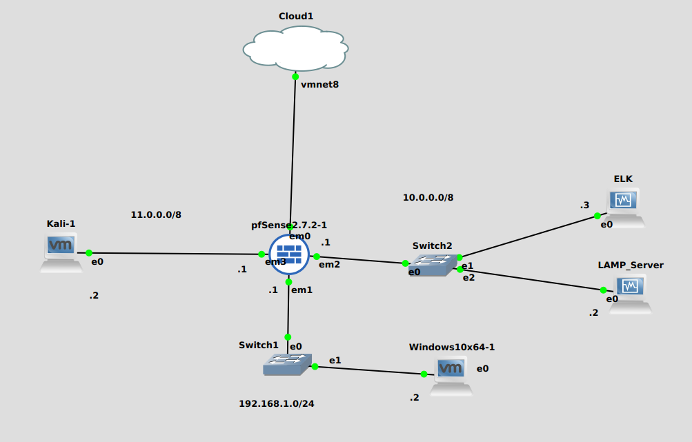

H&igrave;nh 1: M&ocirc; h&igrave;nh tri&#7875;n khai:

<ul class="c9 lst-kix_n624q0c60ptp-0 start"><li class="c3 c6 li-bullet-0">Kali: m&aacute;y s&#7917; d&#7909;ng ph&acirc;n v&ugrave;ng External, d&ugrave;ng &#273;&#7875; t&#7845;n c&ocirc;ng.</li><li class="c3 c6 li-bullet-0">pfSense: t&#432;&#7901;ng l&#7917;a, d&ugrave;ng &#273;&#7875; ng&#259;n ch&#7863;n v&agrave; c&agrave;i &#273;&#7863;t Suricata.</li><li class="c3 c6 li-bullet-0">Window 10: d&ugrave;ng &#273;&#7875; c&#7845;u h&igrave;nh pfSense.</li><li class="c3 c6 li-bullet-0">ELK: h&#7879; th&#7889;ng SIEM(h&#7879; th&#7889;ng qu&#7843;n logs v&agrave; s&#7921; ki&#7879;n t&#7853;p trung), &#7903; &#273;&acirc;y ch&uacute;ng ta s&#7869; tri&#7875;n khai ELK, sau &#273;&oacute; s&#7869; g&#7917;i log c&#7911;a Zeek v&#7873; &#273;&acirc;y &#273;&#7875; ph&acirc;n t&iacute;ch v&agrave; x&#7917; l&yacute; c&#7843;nh b&aacute;o.</li><li class="c3 c6 li-bullet-0">LAMP: h&#7879; th&#7889;ng web Server, &#273;&atilde; tri&#7875;n khai Linux, Apache, MariaDB v&agrave; Php.</li></ul>

<ol class="c9 lst-kix_f3l683b8n0mh-0 start" start="1"><li class="c7 c6 li-bullet-0"><h2 id="h.nmlpg7xyaqz5" style="display:inline">C&agrave;i &#273;&#7863;t Suricata</h2></li></ol>
S&#7917; d&#7909;ng m&aacute;y Window 10 &#273;&#7875; v&agrave;o pfSense, ti&#7871;p t&#7909;c theo h&#432;&#7899;ng d&#7851;n sau:

System &gt; Package Manage &gt; Available Package

T&#7841;i thanh t&igrave;m ki&#7871;m, nh&#7853;p &ldquo;Suricata&rdquo; v&agrave; ch&#7885;n install.

sau khi c&agrave;i &#273;&#7863;t xong, qua Installed Package:

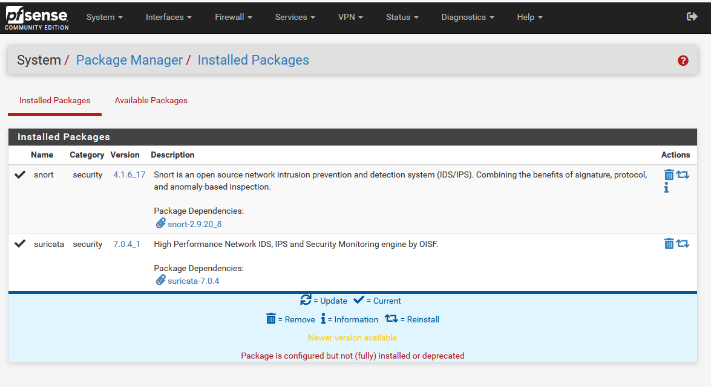

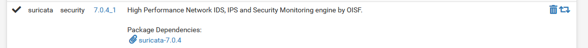

Sau khi c&agrave;i &#273;&#7863;t xong, ch&uacute;ng ta c&oacute; th&#7875; thi&#7871;t l&#7853;p interface v&agrave; &aacute;p d&#7909;ng Rule l&ecirc;n Interface &#273;&oacute; &#273;&#7875; gi&aacute;m s&aacute;t h&#7879; th&#7889;ng m&#7841;ng.

<ol class="c9 lst-kix_f3l683b8n0mh-0" start="2"><li class="c7 c6 li-bullet-0"><h2 id="h.pp83x1j4wq7" style="display:inline">C&agrave;i &#273;&#7863;t Zeek.</h2></li></ol>
Ch&uacute;ng ta s&#7869; c&agrave;i &#273;&#7863;t Zeek l&ecirc;n LAMP Server, &#273;&#7875; gi&aacute;m s&aacute;t Web Server.

C&oacute; th&#7875; tham kh&#7843;o trang ch&#7911; &#273;&#7875; c&agrave;i &#273;&#7863;t: <a class="c14" href="https://www.google.com/url?q=https://docs.zeek.org/en/master/install.html&amp;sa=D&amp;source=editors&amp;ust=1718437905161116&amp;usg=AOvVaw3luzmo-3mK0vONFGTheQow">Trang ch&#7911; Zeek</a>

LAMP server c&#7911;a t&ocirc;i &#273;ang s&#7917; d&#7909;ng l&agrave; Debian Server n&ecirc;n s&#7869; c&agrave;i &#273;&#7863;t c&aacute;c b&#432;&#7899;c sau:

Ch&#7841;y d&#432;&#7899;i quy&#7873;n admin(sudo):
<ul class="c9 lst-kix_vniof8ix3to7-0 start"><li class="c3 c6 li-bullet-0">apt-get update &amp;&amp; apt-get upgrade</li><li class="c3 c6 li-bullet-0">apt-get install curl gnupg2 wget -y</li><li class="c3 c6 li-bullet-0">url -fsSL https://download.opensuse.org/repositories/security:zeek/xUbuntu_20.04/Release.key | gpg --dearmor | tee /etc/apt/trusted.gpg.d/security_zeek.gpg</li><li class="c3 c6 li-bullet-0">echo &#39;deb http://download.opensuse.org/repositories/security:/zeek/xUbuntu_20.04/ /&#39; | tee /etc/apt/sources.list.d/security:zeek.list</li><li class="c3 c6 li-bullet-0">echo &#39;deb http://download.opensuse.org/repositories/security:/zeek/xUbuntu_20.04/ /&#39; | tee /etc/apt/sources.list.d/security:zeek.list</li><li class="c3 c6 li-bullet-0">apt-get update &amp;&amp; apt-get install zeek -y</li></ul>
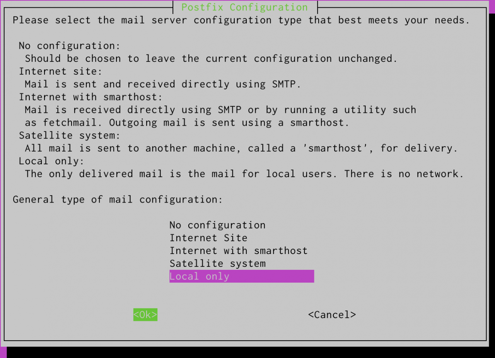

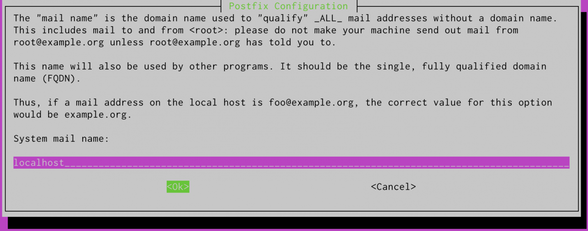

sau khi c&agrave;i &#273;&#7863;t xong, ch&uacute;ng ta s&#7869; link zeek v&agrave; h&#7879; th&#7889;ng
<ul class="c9 lst-kix_t9g2oxykvees-0 start"><li class="c3 c6 li-bullet-0">echo &quot;export PATH=$PATH:/opt/zeek/bin&quot; &gt;&gt; ~/.bashrc</li><li class="c3 c6 li-bullet-0">source ~/.bashrc</li></ul>
Ki&#7875;m tra version:

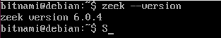

V&agrave;o networks.cfg &#273;&#7875; c&#7845;u h&igrave;nh d&#7843;i m&#7841;ng c&#7847;n gi&aacute;m s&aacute;t:

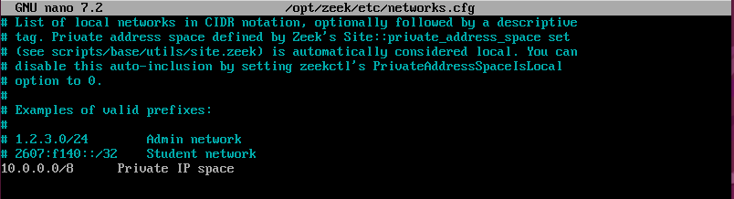

Ti&#7871;c t&#7909;c c&#7845;u h&igrave;nh Zeek ch&#7841;y ch&#7871; &#273;&#7897; Standalone

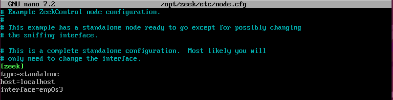

[zeek]

type=standalone

host=localhost

interface=&lt;t&ecirc;n_interface_c&#7847;n_gi&aacute;m_s&aacute;t&gt;

L&#432;u &yacute;:

Zeek m&#7863;c &#273;&#7883;nh th&#432;&#7901;ng ch&#7841;y tr&ecirc;n ch&#7871; &#273;&#7897; Standalone, nh&#432;ng b&#7841;n c&#361;ng c&oacute; th&#7875; c&#7845;u h&igrave;nh Cluster. Khi &#273;&oacute; m&aacute;y ch&#7911; Zeek s&#7869; ch&#7841;y d&#432;&#7899;i quy&#7873;n master, c&ograve;n c&aacute;c node c&ograve;n l&#7841;i s&#7869; ch&#7841;y d&#432;&#7899;i quy&#7873;n slave. khi &#273;&oacute;:
<ul class="c9 lst-kix_gvazb920l6lb-0 start"><li class="c3 c6 li-bullet-0">M&#7841;ng c&#7847;n gi&aacute;m s&aacute;t s&#7869; l&agrave; c&aacute;c &#273;&#432;&#7901;ng m&#7841;ng c&#7911;a c&#7843; master v&agrave; slave</li><li class="c3 c6 li-bullet-0">B&#7841;n s&#7869; ph&#7843;i &#273;&aacute;nh d&#7845;u # (comment) &#273;&#7875; kh&ocirc;ng k&iacute;ch ho&#7841;t standalone v&agrave; c&#7845;u h&igrave;nh c&aacute;c node slave nh&#432; h&igrave;nh b&ecirc;n d&#432;&#7899;i.</li></ul>
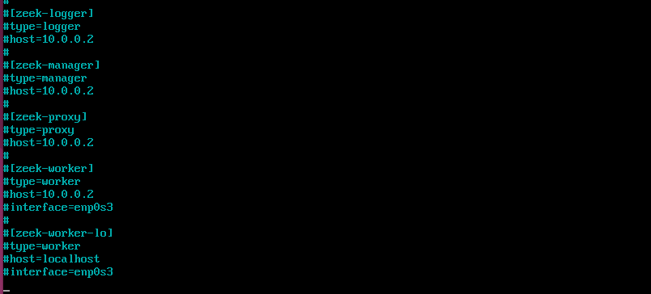

ti&#7871;p t&#7909;c c&acirc;u l&#7879;nh: zeek check

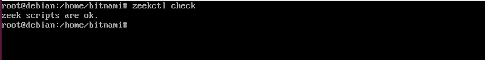

ki&#7875;m tra c&#7845;u h&igrave;nh th&agrave;nh c&ocirc;ng, ch&uacute;ng ta s&#7869; &aacute;p d&#7909;ng c&#7845;u h&igrave;nh, kh&#7903;i &#273;&#7897;ng l&#7841;i v&agrave; b&#7855;t &#273;&#7847;u gi&aacute;m s&aacute;t b&#7857;ng c&acirc;u l&#7879;nh zeekctl deploy

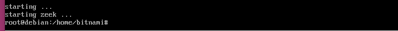

sau khi deploy th&agrave;nh c&ocirc;ng, ki&#7875;m tra c&#7845;u h&igrave;nh.

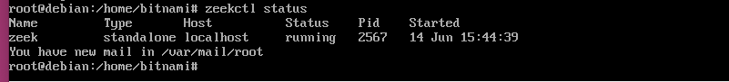

ki&#7875;m tra th&#7917; file log:

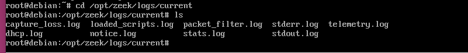

khi n&agrave;y ch&#432;a c&oacute; c&aacute;c truy c&#7853;p v&agrave;o web server, n&ecirc;n ch&#432;a c&oacute; c&aacute;c log nh&#432; conn.log, http.log, &hellip; nh&#432;ng y&ecirc;n t&acirc;m l&agrave; khi c&aacute;c b&#7841;n truy c&#7853;p v&agrave;o webserver th&igrave; zeek s&#7869; t&#7921; &#273;&#7897;ng xu&#7845;t c&aacute;c log &#273;&oacute; ra.

&#272;&atilde; ho&agrave;n t&#7845;t c&agrave;i Zeek &#273;&#7875; gi&aacute;m s&aacute;t Web server.

T&#7841;i &#273;&acirc;y ch&uacute;ng ta s&#7869; c&agrave;i th&ecirc;m Filebeat &#273;&#7875; g&#7917;i log v&#7873; cho ELK server:
<ul class="c9 lst-kix_bg5k4yqu0s57-0 start"><li class="c3 c6 li-bullet-0">wget -qO - https://artifacts.elastic.co/GPG-KEY-elasticsearch | sudo apt-key add -</li><li class="c3 c6 li-bullet-0">sudo apt-get install apt-transport-https</li><li class="c3 c6 li-bullet-0">echo &quot;deb https://artifacts.elastic.co/packages/8.x/apt stable main&quot; | sudo tee -a /etc/apt/sources.list.d/elastic-8.x.list</li><li class="c3 c6 li-bullet-0">echo &quot;deb https://artifacts.elastic.co/packages/oss-8.x/apt stable main&quot; | sudo tee -a /etc/apt/sources.list.d/elastic-8.x.list</li><li class="c3 c6 li-bullet-0">sudo apt-get update &amp;&amp; sudo apt-get install filebeat</li><li class="c3 c6 li-bullet-0">sudo systemctl&nbsp;enable filebeat</li></ul>
Sau khi c&agrave;i &#273;&#7863;t xong, ki&#7875;m tra l&#7841;i.

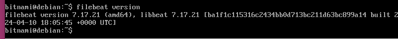

ch&uacute;ng ta v&agrave;o filebeat.yml &#273;&#7875; c&#7845;u h&igrave;nh

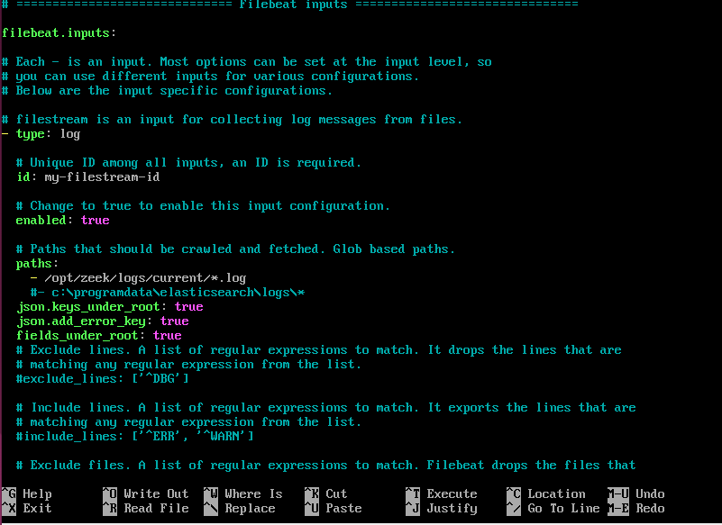

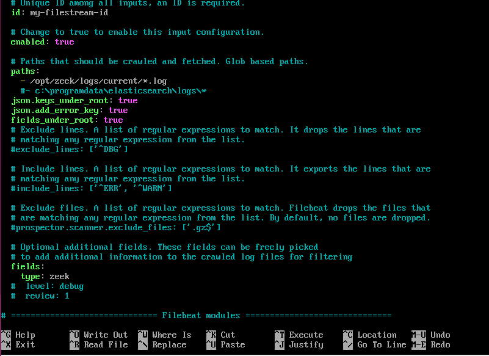

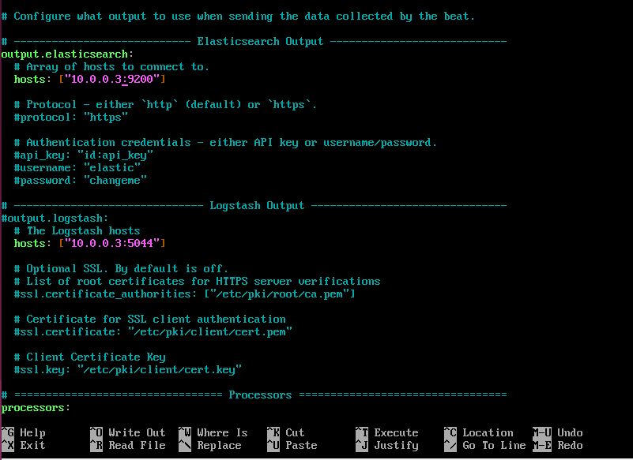

sau khi c&#7845;u h&igrave;nh filebeat.yml, test c&#7845;u h&igrave;nh

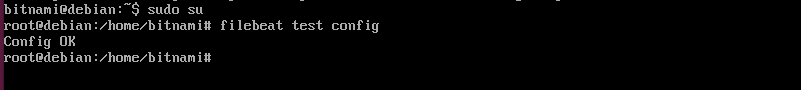

ch&#7841;y c&acirc;u l&#7879;nh filebeat setup -e&nbsp;&#273;&#7875; thi&#7871;t l&#7853;p filebeat.

ki&#7875;m tra t&igrave;nh systemctl:

&#273;&atilde; ho&agrave;n t&#7845;t thi&#7871;t l&#7853;p.

<ol class="c9 lst-kix_f3l683b8n0mh-0" start="3"><li class="c6 c7 li-bullet-0"><h2 id="h.umx5kkdlc7ly" style="display:inline">Ki&#7875;m tra log t&#7841;i m&aacute;y ch&#7911; ELK.</h2></li></ol>
M&#7903; tr&igrave;nh duy&#7879;t v&agrave; v&agrave; truy c&#7853;p nh&#432; sau: http://&lt;&#273;&#7883;a_ch&#7881;_ip&gt;//app/home

Ti&#7871;p t&#7909;c v&agrave;o Index 

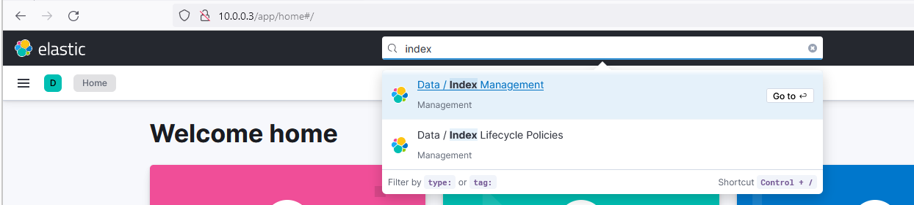

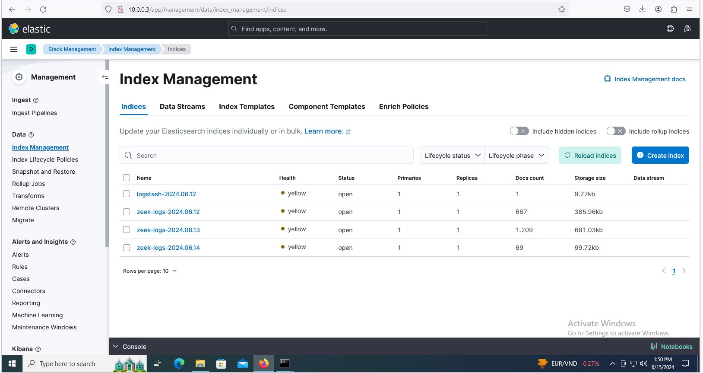

v&agrave;o Discover ki&#7875;m tra log:

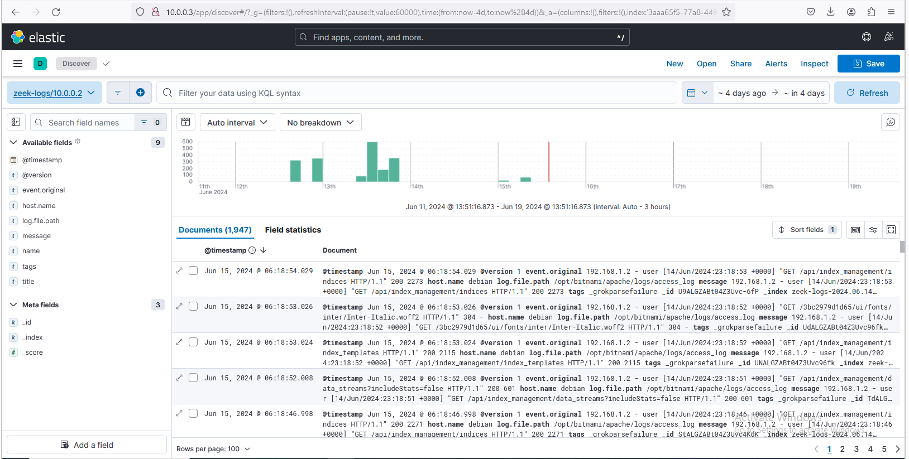

&#273;&atilde; ho&agrave;n t&#7845;t.
</body></html>
